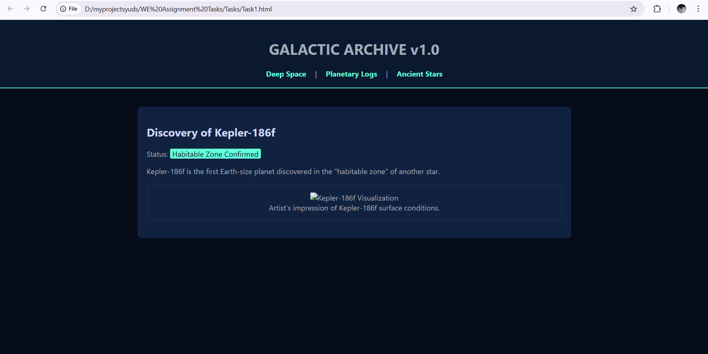
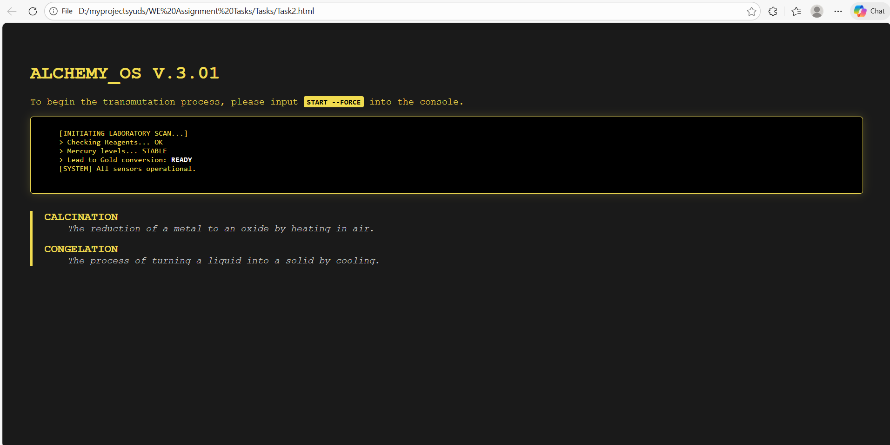
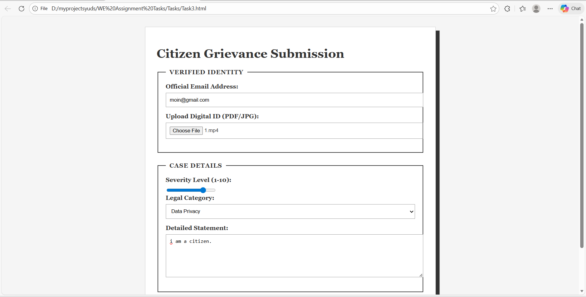
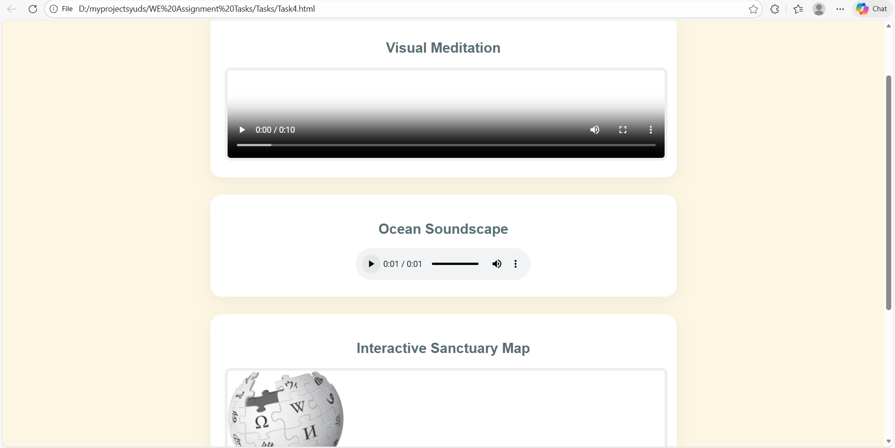
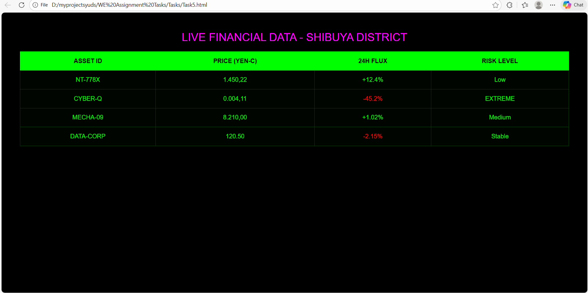

# Web Engineering Assignment: Conceptual HTML5 Experiences

**Student Name:** Moin Haider
**Roll No:** 22SW075
**Project Focus:** Advanced Semantic HTML5 & Creative Web Design

---

## 🚀 Executive Summary
This project demonstrates a beginner-to-advanced transition in HTML5 development. Instead of traditional layouts, I have developed five unique conceptual environments focusing on semantic integrity, accessibility, and modern web standards.

---

## 📂 Task Breakdown & Visual Outputs

### 🌌 Task 1: The Galactic Archive (Museum Portal)
* **Concept:** A digital preservation exhibit for exoplanetary data.
* **Key Tags:** `<header>`, `<nav>`, `<main>`, `<figure>`, `<mark>`.

### 🧪 Task 2: The Alchemist's Laboratory (Technical Log)
* **Concept:** A simulated terminal for documenting chemical transmutations.
* **Key Tags:** `<pre>`, `<kbd>`, `<samp>`, `<dl>`, `<dt>`, `<dd>`.

### ⚖️ Task 3: Citizens' Court (Legal Submission Portal)
* **Concept:** A high-security government form for filing digital grievances.
* **Key Tags:** `<form>`, `<fieldset>`, `<legend>`, `<label>`, `<input>`, `<select>`, `<textarea>`.

### 🌿 Task 4: The Sensory Sanctuary (Multimedia Hub)
* **Concept:** A relaxation environment utilizing native browser media capabilities.
* **Key Tags:** `<audio>`, `<video>`, `<source>`, `<iframe>`.

### 🏙️ Task 5: Neo-Tokyo Market (Data Terminal)
* **Concept:** A cyberpunk-themed financial dashboard for a futuristic city.
* **Key Tags:** `<table>`, `<thead>`, `<tbody>`, `<tr>`, `<th>`, `<td>`, `<caption>`.

---
*Developed as part of the Web Engineering curriculum - 2026*
